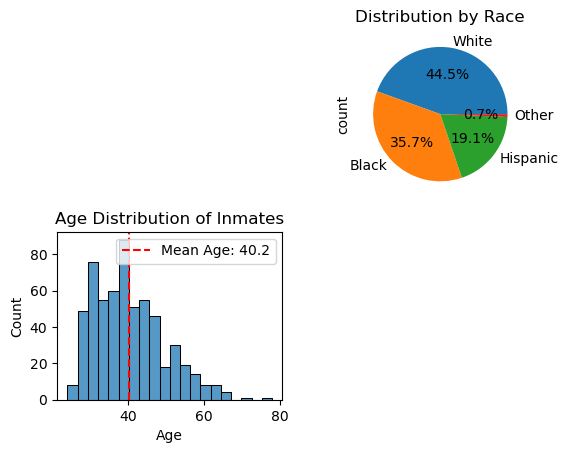

# Final Words, Last Impressions: Sentiment and Demographic Insights from Death Row Last Statements
## Project by Vickie Knight, Chelsea Li, Danawit Grume Taffes

### I. Introduction and motivation
### II. Corpus
The contents of the corpus we are working with contain the last words of every inmate executed since 1984. The contents come from the Texas Department of Criminal Justice. It includes the statements of 591 inmates, with the earliest recorded on December 7, 1982, and the latest on October 1, 2024. In terms of race, the majority of inmates in the dataset are White, accounting for 263 individuals. Black inmates comprise 211 of the entries, followed by Hispanic inmates with 113, and 4 inmates identified as belonging to other racial groups. The age of the inmates at the time of execution ranges from 24 to 78 years, with an average age of 40.2. Geographically, Harris County leads as the jurisdiction with the highest number of executions, contributing 135 cases. This is followed by Dallas County with 65, Bexar County with 46, Tarrant County with 45, and Nueces County with 17. These counties represent the areas with the most significant contributions to the dataset, underscoring regional patterns in capital punishment within Texas.

### III. Modeling
#### A. Training data
#### B. Model architecture
#### C. Training considerations (optional)
### IV. Describing/visualizing results
### V. Discussion
